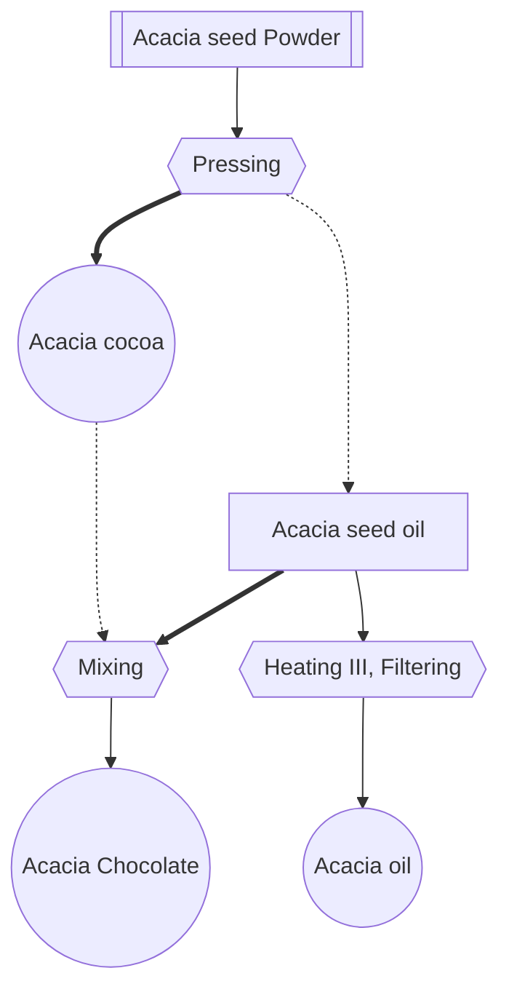

---
aliases:
  - Acacia oil
  - Acacia cocoa
  - Acacia chocolate
---

```mermaid
graph TD;

A[[Acacia seed Powder]]
S{{Pressing}}
K[Acacia seed oil]
L((Acacia cocoa))
M((Acacia Chocolate))
N{{Mixing}}
X{{Heating III, Filtering}}
Y((Acacia oil))

A --> S
S -..-> K
S ==> L
K ==> N
L -..-> N
N --> M
K --> X
X --> Y


class A,B,C,D,E,F,G,H,I,J internal-link;
```
