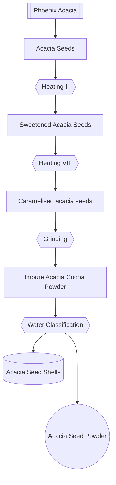

```mermaid
graph TD;

A[[Phoenix Acacia]]
X[Acacia Seeds]
Y{{Heating II}}
Z[Sweetened Acacia Seeds]
T{{Heating VIII}}
U[Caramelised acacia seeds]
V{{Grinding}}
W[Impure Acacia Cocoa Powder]
P{{Water Classification}}
Q((Acacia Seed Powder))

R[(Acacia Seed Shells)]


A --> X
X --> Y
Y --> Z
Z --> T
T --> U
U --> V
V --> W
W --> P
P ---> Q
P --> R

class A,B,C,D,E,F,G,H,I,J internal-link;
```
