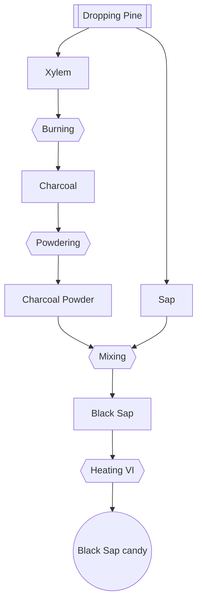

```mermaid
graph TD;
A[[Dropping Pine]]
X[Xylem]
Y{{Burning}}
Z[Sap]
T[Charcoal]
U{{Powdering}}
V[Charcoal Powder]
W{{Mixing}}
P[Black Sap]
Q{{Heating VI}}
R((Black Sap candy))


A --> X
A --> Z
X --> Y
Y --> T
T --> U
U --> V
V --> W
Z --> W
W --> P
P --> Q
Q --> R

class A,B,C,D,E,F,G,H,I,J internal-link;
```
