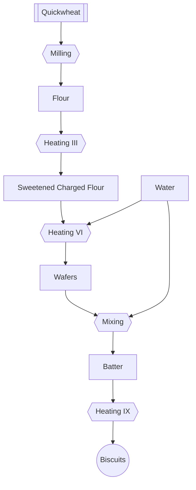

```mermaid
graph TD;

A[[Quickwheat]]
X[Flour]
Y[Water]
Z[Wafers]
V[Batter]
W((Biscuits))
P{{Heating III}}
K{{Heating VI}}
L[Sweetened Charged Flour]
Q{{Heating IX}}
R{{Milling}}
M{{Mixing}}

A --> R
R --> X
Z --> M
Y --> M
X --> P
P --> L
L --> K
K --> Z
V --> Q
Q --> W
Y --> K
M --> V

class A,B,C,D,E,F,G,H,I,J internal-link
```
