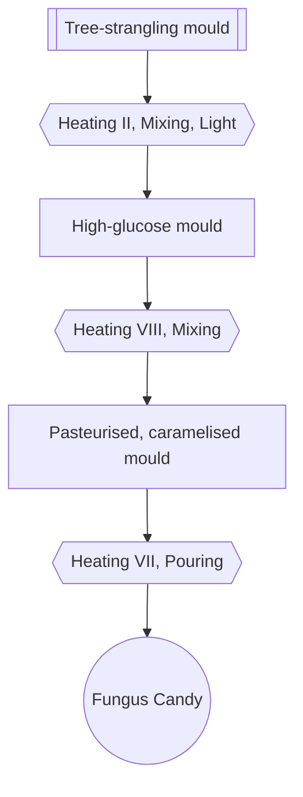

```mermaid
graph TD;
A[[Tree-strangling mould]];
X{{Heating II, Mixing, Light}};
Y[High-glucose mould];
Z{{Heating VIII, Mixing}};
T[Pasteurised, caramelised mould];
U{{Heating VII, Pouring}};
V((Fungus Candy));

A --> X;
X --> Y;
Y --> Z;
Z --> T;
T --> U;
U --> V;

class A,B,C,D,E,F,G,H,I,J internal-link;
```
