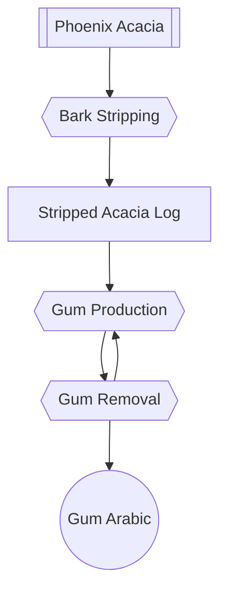

```mermaid
graph TD;

A[[Phoenix Acacia]];
X{{Bark Stripping}};
Y[Stripped Acacia Log];
Z{{Gum Production}};
T{{Gum Removal}};
U((Gum Arabic));

A --> X;
X --> Y;
Y --> Z;
Z --> T;
T --> U;
T --> Z;

class A,B,C,D,E,F,G,H,I,J internal-link
```
