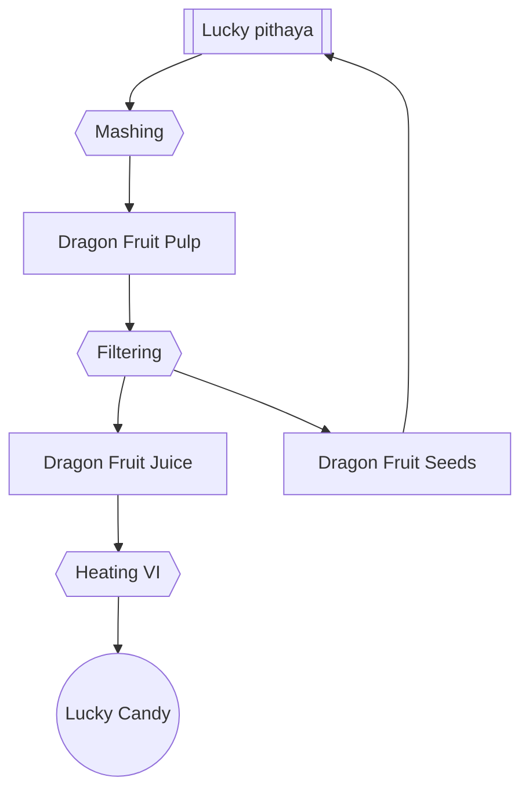

```mermaid
graph TD;

A[[Lucky pithaya]]
X{{Mashing}}
Y[Dragon Fruit Pulp]
Z{{Filtering}}
T[Dragon Fruit Juice]
U{{Heating VI}}
V((Lucky Candy))
W[Dragon Fruit Seeds]

A --> X
X --> Y
Y --> Z
Z --> T
T --> U
U --> V
Z --> W
W --> A


class A,B,C,D,E,F,G,H,I,J internal-link
```
