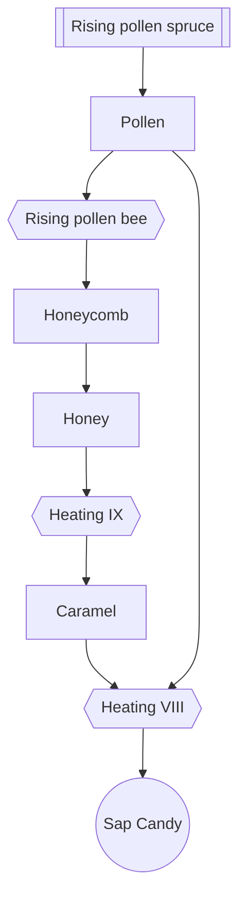

```mermaid
graph TD

A[[Rising pollen spruce]]
X[Pollen]
Y[Honeycomb]
B{{Rising pollen bee}}
Z[Honey]
W[Caramel]
V((Sap Candy))
P{{Heating IX}}
Q{{Heating VIII}}

A --> X
X --> B
B --> Y
Y --> Z
Z --> P
W --> Q
X --> Q
P --> W
Q --> V

class A,B,C,D,E,F,G,H,I,J internal-link;
```
