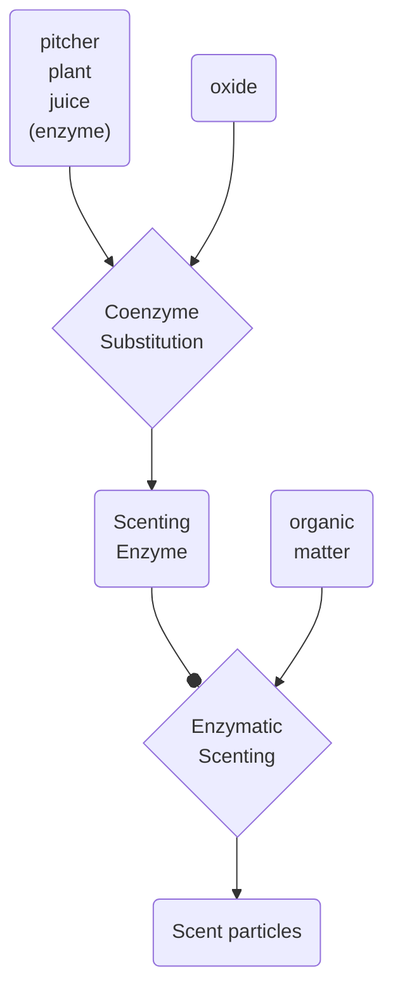

---
aliases:
  - Coenzyme Substitution
  - Enzymatic Scenting
---

```mermaid
flowchart TD
A("`pitcher
plant
juice
(enzyme)`")
B(oxide)
X{"Coenzyme
Substitution"}
C("Scenting
Enzyme")
D("organic
matter")
Y{"Enzymatic
Scenting"}
E(Scent particles)
A --> X
B --> X
X --> C
C --o Y
D --> Y
Y --> E
```
