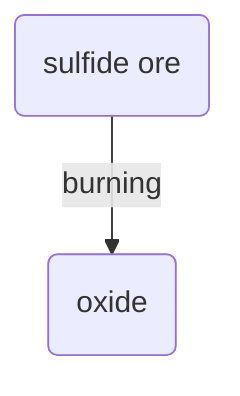
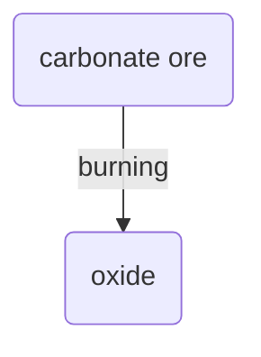

---
aliases:
  - Roasting
  - Lime-like Burning
---

# Roasting

```mermaid
flowchart TD
A(sulfide ore)
B(oxide)
A --burning--> B
```
# Lime-like Burning

```mermaid
flowchart TD
A(carbonate ore)
B(oxide)
A --burning--> B
```
